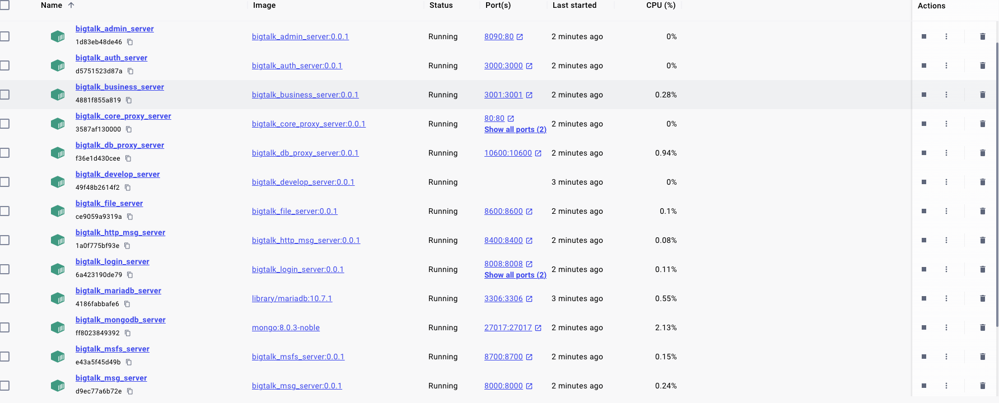
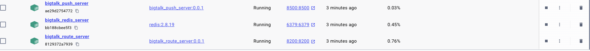
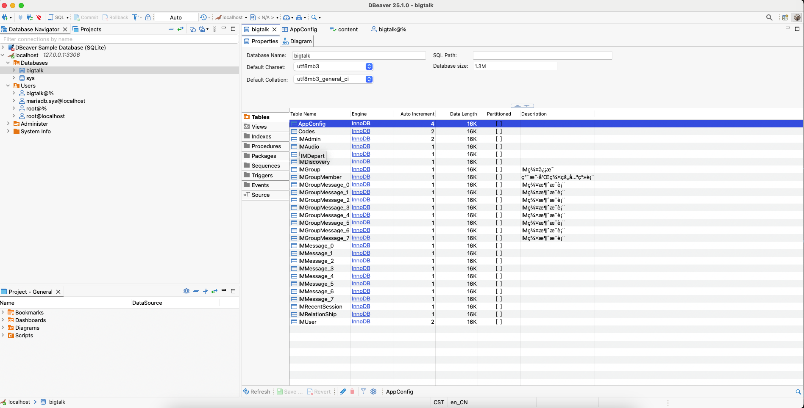
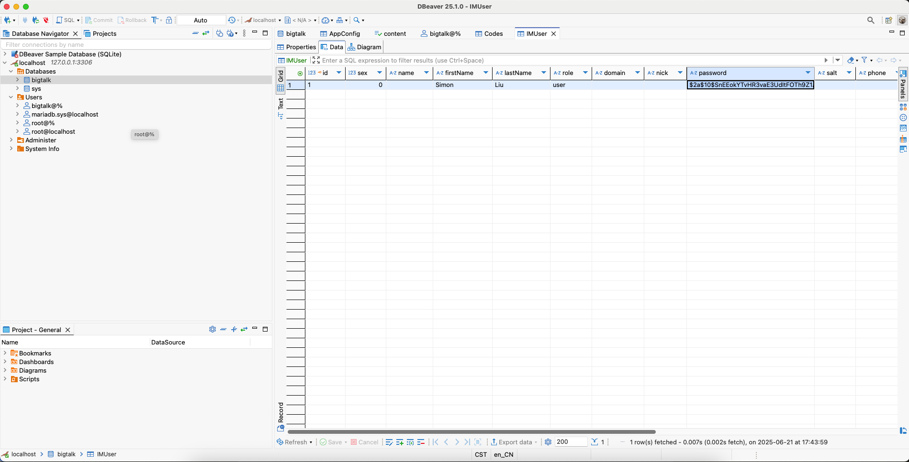
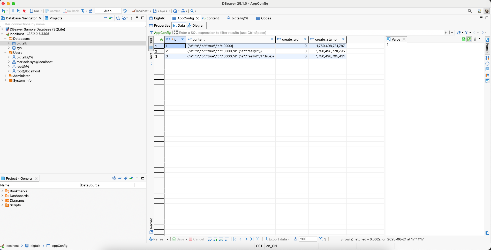
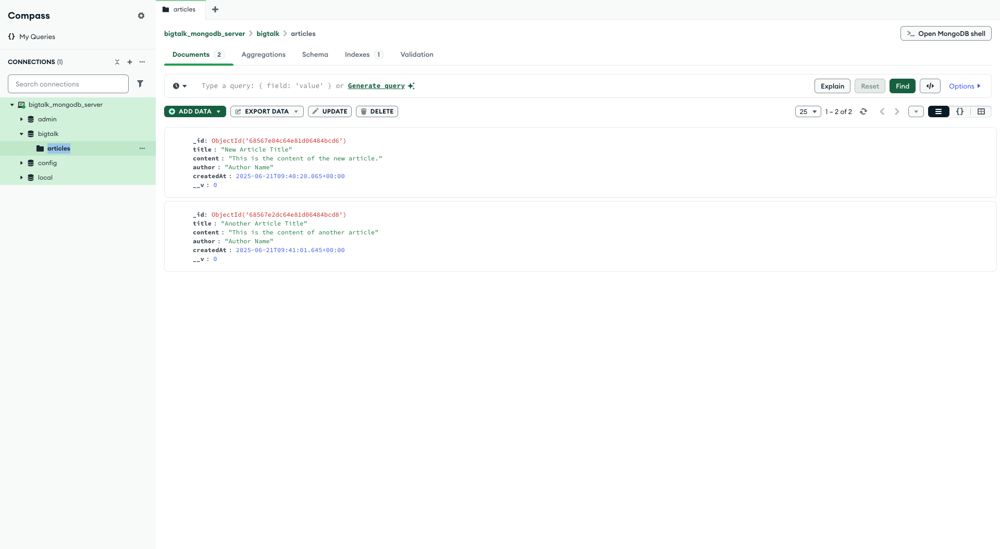
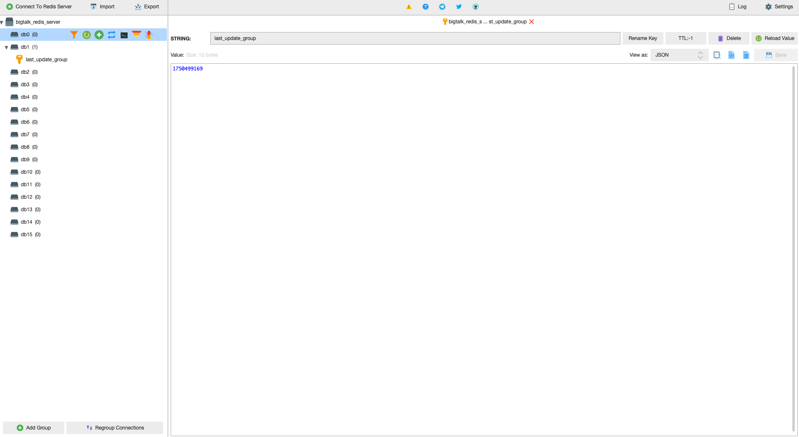

<!--
 * @Author: simon.liu.lsx@gmail.com
 * @Date: 2025-06-21 12:42:39
 * @LastEditors: simon.liu.lsx@gmail.com
 * @LastEditTime: 2025-06-21 18:32:09
 * @FilePath: /BT_Server/README.md
 * @Description: 
 * 
 * Copyright (c) 2025 by simon.liu.lsx@gmail.com, All Rights Reserved. 
-->
# BT_Server

## Usage

Run the following command to run the server side.

```shell
docker compose -f "docker-compose-build.yml" up -d --build
```









## Built With

- C++ 11 (Ubuntu 20.04.6 LTS)
- Node JS
- MySQL、MongoDB、Redis
- Nginx

## Service Responsibilities

- bigtalk_redis_server
- bigtalk_mariadb_server
- bigtalk_mongodb_server
- bigtalk_auth_server
  Authentication and Authorization
- bigtalk_business_server
  Business logic, such as configurations and articles
- bigtalk_admin_server
  Admin Dashboard
- bigtalk_develop_server
  Build Server
- bigtalk_msfs_server
  Image Storage
- bigtalk_file_server
  File Storage
- bigtalk_db_proxy_server
  Agent IM system database reader
- bigtalk_route_server
  Provide forwarding service for clients logged in to different `bigtalk_msg_server`
- bigtalk_login_server
  Monitor the load of each `bigtalk_msg_server`
- bigtalk_push_server
  Push
- bigtalk_msg_server
  Provide IM Socket to the client
- bigtalk_http_msg_server
  TODO
- bigtalk_core_proxy_server
  Reverse proxy service

## Service Interactions

- `bigtalk_core_proxy_server` acts as a reverse proxy server.
- The client connects to `bigtalk_msg_server` through `bigtalk_core_proxy_server` to establish a long-lived IM connection.
- The client connects to `bigtalk_auth_server` through `bigtalk_core_proxy_server` for login authentication.
  - `bigtalk_auth_server` connects to `bigtalk_mariadb_server` via an internal network address.
- The client connects to `bigtalk_business_server` through `bigtalk_core_proxy_server` to access business APIs.
  - `bigtalk_business_server` connects to both `bigtalk_redis_server` and `bigtalk_mariadb_server` and `bigtalk_mongodb_server` via internal network addresses to perform business data read and write operations.
- The client connects to `bigtalk_msfs_server` through `bigtalk_core_proxy_server` to upload and download chat images.
- Users access `bigtalk_admin_server (admin dashboard)` through `bigtalk_core_proxy_server`.
  - `bigtalk_admin_server` communicates with `bigtalk_business_server` via an internal network for business API calls.
- Multiple instances of `bigtalk_msg_server` register with `bigtalk_route_server`, enabling users connected to different `bigtalk_msg_server` instances to communicate with each other.
- All `bigtalk_msg_server` instances register with `bigtalk_login_server`, which maintains load information for each `bigtalk_msg_server`.
- `bigtalk_msg_server` performs read and write operations on `bigtalk_redis_server` and `bigtalk_mariadb_server` through `bigtalk_db_proxy_server`.

## API

[API](./doc/api.md)

## TODO

- [x] Add `bigtalk_auth_server`
- [x] Add `bigtalk_admin_server`
- [x] Add `bigtalk_business_server`
- [x] Add `bigtalk_core_proxy_server`
- [x] Debug login, configuration, articles, and chat features (images, voice, text)
- [x] Add Docker Compose deployment solution
- [ ] Add 2 `bigtalk_msg_server` instances
- [ ] Optimize configuration file organization for each service
- [x] Upgrade Android to API 29
- [x] Upgrade iOS to iOS 11
- [ ] Add Flutter client
- [ ] Add React Native client
- [ ] Add client performance tracking and user behavior analytics
- [ ] Unit testing, stress testing
- [ ] Resolve large Docker image size issue
- [ ] Address storage issues for easier deployment and migration

## 📄 License

This project is licensed under a **dual-license model**:

- 🆓 **Free for non-commercial use** under the [CC BY-NC 4.0 License](https://creativecommons.org/licenses/by-nc/4.0/)
- 💼 **Commercial use is prohibited** unless a separate license is obtained.

If you wish to use this project in a commercial product, please contact the author to obtain a commercial license:

📧 simon.liu.lsx@gmail.com
